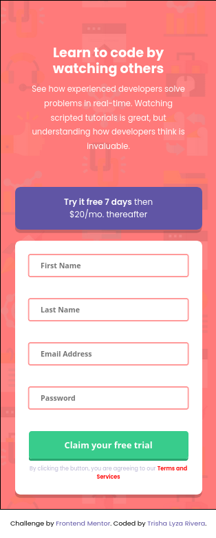
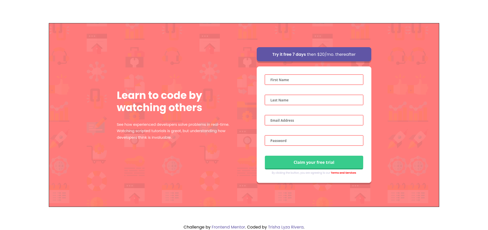

# Frontend Mentor - Intro component with sign up form solution

This is a solution to the [Intro component with sign up form challenge on Frontend Mentor](https://www.frontendmentor.io/challenges/intro-component-with-signup-form-5cf91bd49edda32581d28fd1). Frontend Mentor challenges help you improve your coding skills by building realistic projects. 

## Table of contents

- [Overview](#overview)
  - [The challenge](#the-challenge)
  - [Screenshot](#screenshot)
  - [Links](#links)
- [My process](#my-process)
  - [Built with](#built-with)
  - [What I learned](#what-i-learned)
  - [Continued development](#continued-development)
  - [Useful resources](#useful-resources)
- [Author](#author)

## Overview

### The challenge

Users should be able to:

- View the optimal layout for the site depending on their device's screen size
- See hover states for all interactive elements on the page
- Receive an error message when the `form` is submitted if:
  - Any `input` field is empty. The message for this error should say *"[Field Name] cannot be empty"*
  - The email address is not formatted correctly (i.e. a correct email address should have this structure: `name@host.tld`). The message for this error should say *"Looks like this is not an email"*

### Screenshot

### Links

- Solution URL: [Here](https://www.frontendmentor.io/solutions/intro-component-with-signupform-KmqvfTbrj8)
- Live Site URL: [Here](https://alixiadae.github.io/intro-component-with-signup-form-master/)

## My process

### Built with

- Semantic HTML5 markup
- CSS custom properties
- Flexbox
- SCSS
- Mobile-first workflow
- Javascript

### What I learned

Learned how to do mix-ins and scss functions

### Continued development

I'd like to learn more about form validation and how to have my inputs continually checking for validity

### Useful resources

- [SASS Tutorial](https://www.youtube.com/watch?v=_a5j7KoflTs&t=1805s)

## Author

- Website - [Trisha Lyza Rivera](https://alixiadae.github.io/portfolio/index.html)
- Frontend Mentor - [@AlixiaDae](https://www.frontendmentor.io/profile/AlixiaDae)
- Github - [@AlixiaDae](https://github.com/AlixiaDae)

